AI-инженер, CEO и CTO. Занимаюсь созданием мультиплатформенных приложений, AI-инжинирингом
и цифровой трансформацией бизнесов.

Сейчас в фокусе: агентные архитектуры поверх MCP, экономика токенов и вывод AI-фич
в прод без потери маржи.

### Что я делаю

Развёрнуто

**AI Systems.** Строю loop-based агентные системы — от разовых промптов к замкнутым циклам
с оценкой, самокоррекцией и эскалацией на человека. Агентные архитектуры и тулинг для работы
с данными и системами компании. Надёжный grounding через retrieval и корпоративный контекст.
Адаптация моделей под домен и вывод AI в прод с контролем латенси, стоимости и качества.
Непрерывные эвалы, guardrails и наблюдаемость — как часть продукта, а не постфактум.

**Product & Platform.** Продуктовая разработка на TypeScript, Python, Go и Rust. Event-driven
бэкенды на Kafka и Temporal, хранилища Postgres с pgvector, ClickHouse, Qdrant. Инфраструктура:
Kubernetes, Terraform, мультиоблако и edge. Наблюдаемость на OpenTelemetry, бюджеты по латенси
и стоимости запроса.

**Leadership.** Создаю AI-native бизнес-модели и команды агентов, выстраиваю loop-системы
с эвалами и непрерывной обратной связью. Продукты от нуля до первой выручки, техническая
стратегия и приоритизация инвестиций. Юнит-экономика токенов и маржинальность AI-фич.
Работа с Роспатентом и Реестром ПО Минцифры, работа с данными клиентов. Общение с советом директоров,
инвесторами и корпоративными заказчиками на их языке.

### Стек

### Отрасли

### Связаться

<!-- Замените CHANGEME на свои контакты в profile.json и пересоберите. -->
<!-- links:start -->

<!-- links:end -->
